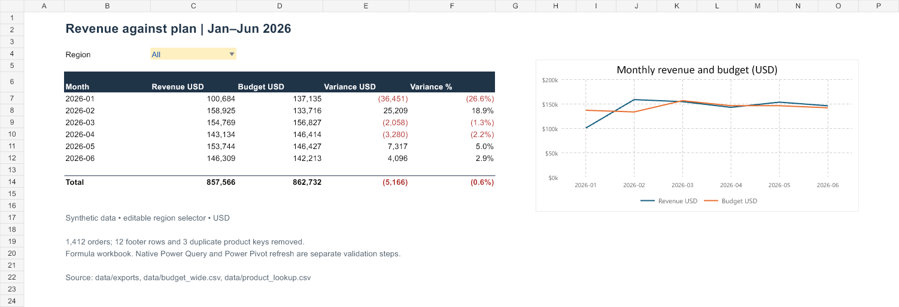

# Finance Data Automation

Turn six inconsistent monthly exports into a reconciled revenue-versus-budget workbook.

## Open the artifact

Download [`Finance-Automation.xlsx`](Finance-Automation.xlsx). `Overview` has an editable region selector and formula-driven monthly revenue, budget and variance, plus a linked chart. The source tables remain inspectable on separate sheets.



The source audit reconciles **1,412 orders, $857,565.60 revenue and $862,732 budget**. It removes 12 recognized footer rows and three duplicate product keys. Unknown headers, duplicate order IDs, unknown products and invalid dates fail explicitly. All data is synthetic, seeded with 20260708.

## Reproduce and refresh

```sh
python -m pip install -r requirements.txt
python prepare_data.py
python -m pytest tests -q
```

Six cleaning tests pass. The generated workbook was recalculated, source totals reconciled and all five sheets rendered for inspection. Replace its Sales, Budget and Products table contents with the corresponding files in `outputs/` to refresh the formulas.

[`queries/`](queries/) contains native Power Query M sources. Create `ParamDataFolder` first, then Sales, Budget and Products in Excel Advanced Editor. Product deduplication explicitly preserves the first source row with sorting and buffering. The Python reference enforces the same rule.

**Completion boundary:** this workbook uses Excel formulas. Native Power Query refresh, a Power Pivot model and slicers have not been embedded or verified. [`docs/MODEL_DASHBOARD_SPEC.md`](docs/MODEL_DASHBOARD_SPEC.md) describes that remaining native model. Do not present the formula workbook as a verified Power Pivot implementation.
